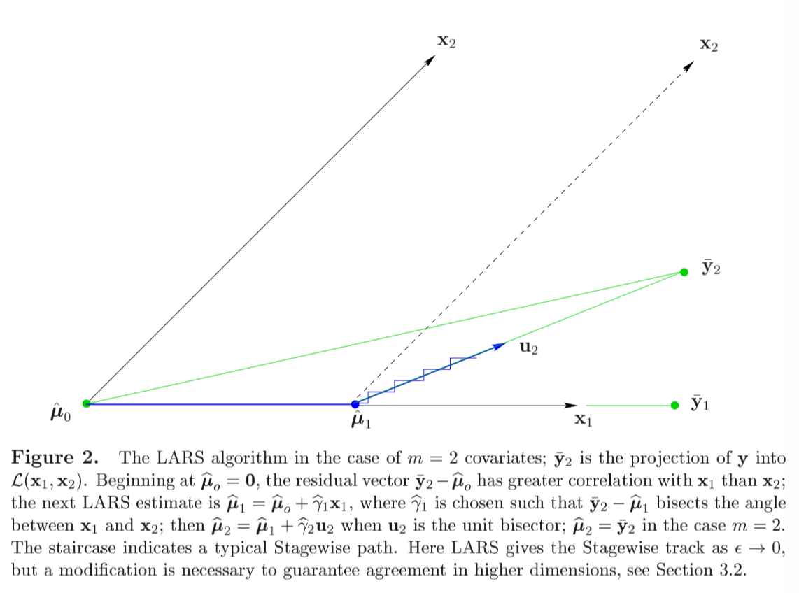
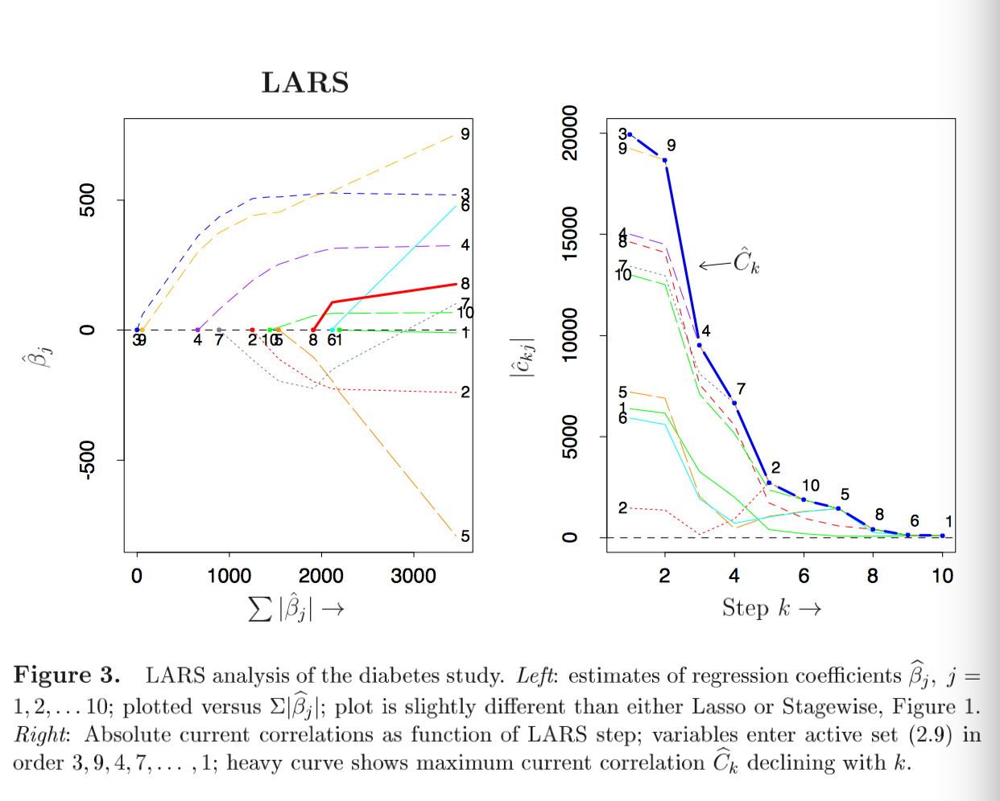

```{r setup, include=FALSE}
options(htmltools.dir.version = FALSE)
```
# Review the Lasso weakness

# The variable selection property for lasso-> up to n variables

For the lasso form penalty problem 
$$\hat { \beta } \in \underset { \beta \in \mathbb { R } ^ { p } } { \operatorname { argmin } } \frac { 1 } { 2 } \| y - X \beta \| _ { 2 } ^ { 2 } + \lambda \| \beta \| _ { 1 }$$
the elastic net paper(2004) said that the lasso can only select up to n parameters. Here are two way to explain this.


---

1. The optimization way. Quote from [stackexchange](https://stats.stackexchange.com/questions/38299/if-p-n-the-lasso-selects-at-most-n-variables)

   The lasso penalty is a optimization problem which fits the KKT condition, so we have the KKT conditon as
   $$\left. \begin{array} { c } { X ^ { T } ( y - X \hat { \beta } ) = \lambda \gamma } \\ { \gamma _ { i } \in \left\{ \begin{array} { l l } { \left\{ \operatorname { sign } \left( \hat { \beta } _ { i } \right) \right\} } & { \text { if } \hat { \beta } _ { i } \neq 0 } \\ { [ - 1,1 ] } & { \text { if } \hat { \beta } _ { i } = 0 } \end{array} \right. , \text { for } i = 1 , \ldots p } \end{array} \right.$$
   We use the main of the KKT conditon that $|X^T(y-X\hat\beta)|=\lambda$, in the abosolute value case we can omit the sub-gradient.

   This formula is a linear system with $\hat\beta$. Since the rank of the matrix $X$ is up to n, so this linear system with unique result only with n line of $\beta$ . Otherwise it will have infinity solutions. 	

   In another words, this type of optimization problem only solvable when active set $E$ is not larger than n predictors.	

   So in such point of view, the key thing is the rank about the hat matrix. In OLS is $X^TX$. 													

---

In the mean time, the ridge-regression form is as following
$$
\hat\beta=(X^TX+\lambda I)^{-1}X^Ty
$$
The rank of hat matrix $X^TX+\lambda I$ can equal to n, so it is solvable.

And for the KKT condition case, maybe because it is strictly convex, so the form of $\gamma$ and the equation we use could change to
$$
\begin{align}
X^T(y-X\hat\beta)=2\lambda\hat\beta\\
(X^TX+\lambda I)\hat\beta=X^Ty
\end{align}
$$
---
Problem: For general problem
$$
\hat { \beta } = \underset { \beta } { \operatorname { argmin } } | y - X \beta | ^ { 2 } + \lambda J ( \beta )=\underset { \beta } { \operatorname { argmin } } L(\beta)
$$
If X is not column-full-rank, then the quadratic form is not strictly convex. 

Proof : The theorem about strictly convex: the first-order deriatives and second order deriatives should strictly great than 0, that is $L'(\beta)>0$ and $L''(\beta)>0$ . (Generally speaking, the deriative and 2nd order deriative(Hessian Matrix) is positive definite or semi-positive definite).

The second deriative of quadratic part of the optimization problem is $X^TX$ , if $X$ is not full-column-rank, then $X^TX$ would be semi-positive definite rather than positive definite. Then this part can only hold the convex rather than strictly convex. 

If the penalty term also cannot hold the strictly convex, than the loss function is convex instead of strictly convex. If the penalty term is srictly convex, than a strictly convex term + convex term is strictly convex term. 

---


## 2.The approximation to OLS view of the lasso problem.

   When lambda is small and close to 0, the lasso estimator is come close to OLS which is solvable only up to n estimators.

   The problem is, ridge regression is also close to OLS when $\lambda$ comes to 0. Why this unsolvable situation do not happen to ridgeregression ?

   The answer is, ridge regression always keep all the predictor in the model, however, for lasso, the number of predictors be selected is monotonic decreaasing via $\lambda$. The number of predictor is maximized when $\lambda$ close to 0, that is, the OLS case, number of predictors equals to n.

---

## Another point of view: the sovable condition for linear system


Another point of view is whether the unorthogonal linear system is solvable。Un orthogonal linear system is solvable if and only it fits the compatibility condition.

The compatibility condition is，the rank of Augmented matrix with response should be equal to the original matrix rank.
$$
(X^TX)\hat\beta=\lambda\gamma+X^Ty
$$
That is,

the rank of $X^TX$ should equal to rank of $(X^TX|\lambda \gamma+X^Ty)$.
 Because we have $X^Ty \in col(X)$，so we need only prove  $\lambda\gamma \mathbf{1} \not\in col(X)$.
 
This cannot be proved yet, however, we can say that because $X^TX$ is not full-rank, so in some case, it is not solvable.

---

# Least Angle Regression


Abstract: 

Useful and less greedy version of traditional forward selection methods.

Main property: 

- Implement the Lasso, lasso Modification: Calculates all possible Lasso estimates for a given problem.

- Different version: Another modification efficiently implements forward stagewise linear regression.

- A simple approximation for the degree of freedom of a LARS estimate is available, from which we derive a $C_p$ estimate of prediction error. thisi allws a principled choice among the range of possible LARS estimates.

---


LARS relates: classic model-selection method known as "forward selection" or "forward stepwise regression."

- Forward Selection

  - Given a collection of possible predictors, select the one largest absolute correlation with the response $y$, say $x_{j_1}$, and perform simple linear regression of $y$ on $x_{j_1}$ , than leaves a residual vector which is orthogonal to $x_{j_1}$. Project the other predictors orthogonally to $x_{j_1}$ nd repeat the selection process.  After k steps this results in a set of predictors $x_{j_1},...,x_{j_k}$ that are then used in the usual way to construct a k-parameter linear model.  

-  Forward stagewise

  - More cautious version of forwad selection-> take thousands tiny steps as it moves toward a final model.

  - Original motivation for the LARS algorithm.

  - LARS-Lasso-Stagewise connection is comceptually as well as computationally useful.

---


#Model construction:

Predict response $y$ from covariates $x_1,\cdots,x_n$ .

By location and scale transformations we always assume that the covariates have been standardized to have mean 0 and unit length, and that the response has mean 0.

$$\sum_{i=1}^n y_i=0\ \ \ \sum_{i=1}^n x_{ij}=0\ \ \ \sum_{i=1}^n x_{ij}^2=1\ \ \ \ \textit{for} \ \ j=1,2,...,m$$

Regression coefficients : $\widehat { \boldsymbol { \beta } } = \left( \widehat { \beta } _ { 1 } , \widehat { \beta } _ { 2 } , \ldots , \widehat { \beta } _ { m } \right) ^ { \prime }$gives prediction vector $\hat\mu$

$$\hat { \boldsymbol { \mu } } = \sum _ { j = 1 } ^ { m } \mathbf { x } _ { j } \hat { \beta } _ { j } = X \hat { \boldsymbol { \beta } } \quad \left[ X _ { n \times m } = \left( \mathbf { x } _ { 1 } , \mathbf { x } _ { 2 } , \ldots , \mathbf { x } _ { m } \right) \right]$$

Total squared error
$$S ( \widehat { \boldsymbol { \beta } } ) = \| \mathbf { y } - \widehat { \boldsymbol { \mu } } \| ^ { 2 } = \sum _ { i = 1 } ^ { n } \left( y _ { i } - \widehat { \mu } _ { i } \right) ^ { 2 }$$
---
$L_1$ norm for lasso 

$$T ( \widehat { \boldsymbol { \beta } } ) = \sum _ { j = 1 } ^ { m } \left| \widehat { \beta } _ { j } \right|$$


$$\textit{Lasso: minimize     }\ \ \ S(\hat\beta) \textit{subject  to }\ \ \ \ T ( \widehat { \beta } ) \leq t$$


>Quadratic programming techniques can be used to solve (5).though we will present an easier method here, closely related to the “homotopy method” of Osborne, Presnell and Turlach (2000a)."

---


 #### Forward Stagewise Linear Regression.


- Begins with $\hat\mu=0$ ,builds up the regression function in successive small steps.

- Let $\hat\mu$ is the current Stagewise estimate, let $\mathbf { c } ( \widehat { \boldsymbol { \mu } } )  $ be the vector of *current correlations* 

  $$\widehat { \mathbf { c } } = \mathbf { c } ( \widehat { \boldsymbol { \mu } } ) = X ^ { \prime } ( \mathbf { y } - \widehat { \boldsymbol { \mu } } )$$

- $\hat c_j$  is proportional to the correlation between covariate $x_j$ and current residual vector. Next step is taken in the direction of the greatest current correlation,

- $$\widehat { j } = \operatorname { argmax } \left| \widehat { c } _ { j } \right| \quad \text { and } \quad \widehat { \boldsymbol { \mu } } \rightarrow \widehat { \boldsymbol { \mu } } + \epsilon \cdot \operatorname { sign } \left( \widehat { c } _ { \hat { j } } \right) \cdot \mathbf { x } _ { \hat { j } }$$

- Need to mentioned here: $\epsilon$ is a "small" constant, "small" is important, otherwise "big" choice like $\epsilon=|\hat c_j|$ leads to the standard forward selection technique.  this could be over greedy.


---


#The main point: 
LARS is a stylized version of the stagewise procedure that uses a simple mathematical formula to accelerate the computations. 


以下是重复论文的无聊描述，参考价值有限，但是因为内容已经高度概括化所以不方便删除，以下是用中文复述一遍主要思想。下午浪费半天一个原因就是因为没注意仔细 $\overline{y_2}$ 是y在 $\mathcal { L } ( X )$ 上的投影，也就是说，如果我们只考虑 $(x_1,x_2)$ ，那么 $\overline y_2$ 就是目标的response. （而且在第一遍看的时候当初理解了这个事实！但是忘了orz）。

$\overline y_2$ 是目标response, 此时， $\overline y_2$ 和 $x_1$ 的correlation比 $x_2$ 大，于是 $\hat\mu_1$ 朝 $x_1$ 更新，然后呢，此时的residual $\overline y_2-\hat\mu_1$ 继续对 $x_1$和$x_2$  找correlation. 慢慢找，直到如上图 $\hat\mu_1$那个点,这时，correlation相等了，那么就停在这里，进行方向切换。而新的方向则是 $x_1$ 和 $x_2$ 的角平分线方向。而LARS的计算过程可以通过一步直接跳到这个需要换方向的点，可以极大的降低计算消耗。（是否能跳过去这里存疑） 

---

Each step adding one covariate to the model, after k steps just k of the $\hat\beta_j$ 's are non-zero. The figure2 showed the m=2 covariates, $X=(x_1,x_2)$ . In this case the current correlation $\widehat { \mathbf { c } } = \mathbf { c } ( \widehat { \boldsymbol { \mu } } ) = X ^ { \prime } ( \mathbf { y } - \widehat { \boldsymbol { \mu } } )$ depend only on the projection $\overline y_2$ of $y$ into the linear space $\mathcal { L } ( X )$ spanned by  $x_1$  and $x_2$ .


-  The algorithm begins at $\hat\mu_0=0$ , Figure 2 has $\overline { \mathbf { y } } _ { 2 } - \widehat { \boldsymbol { \mu } } _ { o }$  making a smaller angle with $x_1$than $x_2$ . In this case, the new correlation can be expressed as
$$\mathbf { c } ( \widehat { \boldsymbol { \mu } } ) = X ^ { \prime } ( \mathbf { y } - \widehat { \boldsymbol { \mu } } ) = X ^ { \prime } \left( \overline { \mathbf { y } } _ { 2 } - \widehat { \boldsymbol { \mu } } \right)$$	 
Then, choose $x_1$ as the direction.
$$\widehat { \boldsymbol { \mu } } _ { 1 } = \hat { \boldsymbol { \mu } } _ { o } + \widehat { \gamma } _ { 1 } \mathbf { x } _ { 1 }$$


- Stagewise would choose $\hat\gamma_1$equal to some value $\epsilon$ , than repeat many times, or make $\hat\gamma_1$ larger enough to make $\hat\mu_1$  equal $\overline y_1$ , the projection of y into $\mathcal { L } \left( \mathbf { x } _ { 1 } \right)$ .

---
LARS uses an intermediate value of $\hat\gamma_1$ , the value that makes $\overline { \mathbf { y } } _ { 2 } - \widehat { \boldsymbol { \mu } }$ , equally correlated with $x_1$ and $x_2$ ; that is, $\overline y_2-\hat\mu_1$  bisects the angle between $x_1$ and $x_2$ , so $c_1(\hat\mu_1)=c_2(\hat\mu_1)$ . 

-  $u_2$be the unit vector lying along the bisector. The next LARS estimate is 
$$\widehat { \boldsymbol { \mu } } _ { 2 } = \widehat { \boldsymbol { \mu } } _ { 1 } + \widehat { \gamma } _ { 2 } \mathbf { u } _ { 2 }$$
With $\hat\gamma_2$chosen to make $\hat\mu_2=\overline y_2$ in the case m=2. With $m>2$ covariates , $\hat\gamma_2$ would be smaller, leading to another change of direction. 

- LARS is motivated by the fact that it is easy to calculate the step size $\hat\gamma_1,\hat\gamma_2,...$, short-circuiting the small Stagewise steps.


#### *We assume that the covariate vector $x_1,x_2,...,x_m$ are linearly independent.*
---

For $\mathcal { A }$  a subset of the indices $\{1,2,...,m\}$ , define the matix
$$X _ { \mathcal { A } } = \left( \cdots s _ { j } \mathrm { x } _ { j } \cdots \right) _ { j \in \mathcal { A } }$$
when the signs $s_j$ equal $\pm 1$ . Let
$$\mathcal{ G } _ { \mathcal { A } } = X _ { \mathcal { A } } ^ { \prime } X _ { \mathcal { A } } \quad \text { and } \quad A _ { \mathcal { A } } = \left( 1 _ { \mathcal { A } } ^ { \prime } \mathcal { G } _ { \mathcal { A } } ^ { - 1 } 1 _ { \mathcal { A } } \right) ^ { - \frac { 1 } { 2 } }$$
$1_{ \mathcal{ A } }$ being a vector of 1's of length equaling $|\mathcal{A}|$  the size of $\mathcal{A}$ . The
$$\text { equiangular vector: }u_{A}  = X _ { \mathcal { A } } w _ { \mathcal { A } } \quad \text { where } \quad w _ { \mathcal { A } } = A _ { \mathcal { A } } G _ { \mathcal { A } } ^ { - 1 } 1 _ { \mathcal { A } }$$
is the unit vector making equal angles, less than $90 ^ { \circ }$ , with the column of $X_\mathcal{A}$, 

$$X _ { \mathcal { A } } ^ { \prime } \mathbf { u } _ { \mathcal { A } } = A _ { \mathcal { A } } 1 _ { \mathcal { A } } \quad \text { and } \quad \left\| \mathbf { u } _ { \mathcal { A } } \right\| ^ { 2 } = 1$$


We saw the previous part in a negative direction. First, we look the final part (12), which should be satisfied as the equal angular .
---

We need find a vector $u_{\mathcal{A}}$ satisfied   $X'u=a\mathbf{1}$, now note that $\mathbb { 1 } = X ^ { \prime } X \left( X ^ { \prime } X \right) ^ { - 1 } \mathbb { 1}$. That is , we have $X'$ in the left hand side. so $u_\mathcal{A}$ have a candidate $X(X'X)^{-1}\mathbf{1}$ , then what we need to do is just standardize it.
$$
\begin{align}
u&=\frac{X(X'X)^{-1}\mathbf{1}}{\sqrt{\mathbf{1}'(X'X)^{-1}X'X(X'X)^{-1}\mathbf{1} }}\\
&=\frac{X(X'X)^{-1}\mathbf{1}}{\sqrt{\mathbf{1}'(X'X)^{-1}\mathbf{1} }}\\
&= \frac{XG^{-1}\mathbf{1}}{\sqrt{\mathbf{1}'G^{-1}\mathbf{1}}}\\
&=X G^{-1}\mathbf{1}\times A\\
&=XA^*G^{-1}\mathbf{1}\\
&=Xw
\end{align}
$$
This is how the equal-angular vector is constructed.
---



---


#### So the problem becomes to a nother one, why the form of vector making equal angles? 

$$X _ { \mathcal { A } } ^ { \prime } \mathbf { u } _ { \mathcal { A } } = A _ { \mathcal { A } } 1 _ { \mathcal { A } } \quad$$

That is, what is this formula mean?

That is, the $cos(\theta)$ between any subset $x_{i_\mathcal{A}}$  and $cos<u,x_{i_{\mathcal{A}}}>$ = $\frac{x_{i_{\mathcal{A}}}' u_{\mathcal{A}}}{||x_{i_{\mathcal{A}}}' u_{\mathcal{A}}||}$ . In this case, 

$X_{ \mathcal{ A } }^{ \prime } \mathbf{ u } _ { \mathcal { A } }$ is the vector about  $x_{i_{\mathcal{A}}}' u_{\mathcal{A}}$ , then if the angular is equal, cos also should equal. However, $X'_{\mathcal{A}}$
projection to the direction in $u_{\mathcal{A}}$ , then right hand side is the length of projection times 1. ( $A_{\mathcal{A}}$ is a value rather a matrix.)

---
# Algorithm: LARS
After the powerful tool about the angular bisector in analytic way, we can "fullly" describe about the LARS.

- Start with $\hat\mu_0=0$ and build up $\hat\mu$ by steps.

  Suppose current estimate is $\hat\mu_{\mathcal{A}}$ ，that $\hat c=X'(y-\hat\mu_{\mathcal{A}})$  , is the current correlations. $\mathcal{A}$ is active set which indices corresponding covariates with the greatest absolute current correlations 
  $$\widehat { C } = \max _ { i } \{ | \widehat { c } _ { j } | \} \quad \text { and } \quad \mathcal { A } = \left\{ j : \left| \hat { c } _ { j } \right| = \widehat { C } \right\}$$
  Letting 
  $$s _ { j } = \operatorname { sign } \left\{ \widehat { c } _ { j } \right\} \quad \text { for } \quad j \in \mathcal { A }$$
 
---
 we compute $X _ { \mathcal { A } } , A _ { \mathcal { A } }$ and $u_{\mathcal{A}}$ we showed previous, the equal angle trisector and the inner product vector.
  $$\mathbf { a } \equiv X ^ { \prime } \mathbf { u } _ { \mathcal { A } }$$
Then the next step of the LARS algorithm updates $\hat\mu_{\mathcal{A}}$, say to
$$\widehat { \boldsymbol { \mu } } _ { \mathcal { A } _ { + } } = \widehat { \boldsymbol { \mu } } _ { \mathcal { A } } + \widehat { \gamma } \mathbf { u } _ { \mathcal { A } }$$
 where
$$\widehat { \gamma } = \min _ { j \in \mathcal { A } ^ { c } } \left\{ \frac { \widehat { C } - \widehat { c } _ { j } } { A _ { \mathcal { A } } - a _ { j } } , \frac { \widehat { C } + \widehat { c } _ { j } } { A _ { \mathcal { A } } + a _ { j } } \right\}$$

---


还是老样子从 $\hat\mu_0=0$ 开始，所以还是两件事，计算当前的correlation  $\hat c=X'(y-\hat\mu_{\mathcal{A}})$ . 其中 $\mathcal{A}$ 是一个indices set包括了每一步最大相关系数。这里有点奇怪。特别是 $\hat C$ 的定义形式。

  Emmmm，是不是可以这么解释，因为开始转向的时候， $c_1=c_2$所以此时往 $u_2$的方向走并不会影响 $c_1$和 $c_2$ 但是会影响 $c_3$。 所以等走走走, $c_3$ 又会减小减小。好像不太对，residual的变化。。。。如果按figure2的话，residual对 $x_1$ 的角度一直在增大，角度增大导致correlation会减小，因为 $x_1$ 的$\gamma$ 在增大，$x_1$ 方向的解释越来越多，而同时，对 $x_2$ 的角度一直在减小,也就是cos在增大，correlation在增大，一减一增两个过程直到这两个correlation相等

  然后回到这个过程，也就是在找了一段时间之后，有记录:  $\mathcal{A}$ 。注意correlation的定义式： $\hat c=X'(y-\hat\mu_{\mathcal{A}})$ $X$ 是 $n\times p$ ， $p\times n\times n\times1=p\times 1$ ， $\hat c$是此时的模型的已建模部分 $\hat\mu_{\mathcal{A}}$ 的residual关于 X的 correlation。

  按角平分线的思路,这时候在第 $i$ 维的变化是主要的， $i-1$维上应该都是角平分线所以是一致的？
  A:是一致的，这时候已有的Active Set的correlation是同进同退的，过程后文中有。
---

  但是 $\mathcal{A}$  这样定义感觉很奇怪啊。  $\mathcal{A}$里面只包含了correlation是最大的那几个，也就是说一直走一直走，走到有新的correlation能加进来，那再改变方向，重新计算 $u_{\mathcal{A}}$，否则就一直按这个方向走。比如说回到figure2的图例，在一开始，最大的correlation只有 $x_1$这个方向，走一小步， $x_2$ 方向的correlation还是小于 $x_1$ ，所以 $\mathcal{A}$还是只有{1}。直到residual 的correlation到 $x_1$和 $x_2$ 一致，那么就有了两个同时达到max的correlation，那就得重新计算 $u_\mathcal{A}$ .  
  那这么理解就没问题了，于是下一步是通过这些东西计算步长.
  
---
 
 
-   Back to paper understanding mode

  Define: 
$$\boldsymbol { \mu } ( \gamma ) = \widehat { \boldsymbol { \mu } } _ { \mathcal { A } } + \gamma \mathbf { u } _ { \mathcal { A } }$$
  for $\gamma>0$ , so that the current correlation  

$$c_j(\gamma)=x'_j(y-\mu(\gamma))=\hat c_j -\gamma \alpha_j.$$

for $j\in \mathcal{A}$ ,  around the equation (20), the definition of correlation, max correlation, direction , yield
$$\left| c _ { j } ( \gamma ) \right| = \widehat { C } - \gamma A _ { \mathcal { A } }$$
 That is the current correlation for j, the max correlation minus foot length multiply the projection vector length. Should be mentioned that here the $j \in \mathcal{A}$. 
 
 
 也就是当前的j的correlation，是最大correlation减去步长乘以和投影向量的长度有关的一个玩意( $A_\mathcal A$)。注意，这里 $j\in \mathcal{A}$ 。也就和之前描述的，因为走的是角平分线，所以这帮已经active的variable同进退。
然后下一步该考虑的就是不在 $\mathcal{A}$里的j。 
 
 
 
---


For $j\in \mathcal{A}^c$ , the two formula upon shows that $c_j(\gamma)$ equals the maximal value at $\gamma=（\hat C-\hat c_j)/(A_\mathcal{A}-a_j)$ . Likewise $-c_j(\gamma)$ , the current correlation for the reversed covariate $-x_j$ ,  achieves maximality at $（\hat C+\hat c_j)/(A_\mathcal{A}+a_j)$ .

Therefore $\gamma$ in (24), is the *smallest positive value of $\gamma$ such that some new index  $\hat j$ joins the active set;*  $\hat j$ is the smallest positive value of $\gamma$ such that some new index $\hat j$  joins the active set; $\hat j$ is the minimizing index in (24) , the foot length of every j in $\mathcal A^c$ . the new active set is $\mathcal { A } \cup \{ \widehat { j } \} $ , the new maximum absolute correlation is $\widehat { C } _ { + } = \widehat { C } - \hat { \gamma } A _ { A }$ . 

The figure 10 shows the LARS in diabetes data. 10 iterations for procedure from start to end. The join order or LARS is same as Lasso. However, tracks of $\hat\beta_j$ are nearly but not exactly as either the LASSO or Stagewise tracks. 


---

The right panel shows the absolute current correlation goes done with the LARS step k. 
$$\widehat { C } _ { k } = \max \left\{ \left| \widehat { c } _ { k j } \right| \right\} = \widehat { C } _ { k - 1 } - \widehat { \gamma } _ { k - 1 } A _ { k - 1 }$$
Declines with k.

---


---


#### Relation between LARS and OLS.

Suppose LARS has just completed step k-1, giving $\hat\mu_{k-1}$and is embarking upon step k.The active set $\mathcal{A}_k$ will have k members, giving $X _ { k } , \mathcal { G } _ { k } , A _ { k }$ and $u_k$ . Similarly, let $\overline y_k$  indicate the projection of y into $\mathcal { L } \left( X _ { k } \right)$, which, since $\widehat { \boldsymbol { \mu } } _ { k - 1 } \in \mathcal { L } \left( X _ { k - 1 } \right)$  , is 
$$\overline { \mathbf { y } } _ { k } = \widehat { \boldsymbol { \mu } } _ { k - 1 } + X _ { k } \mathcal { G } _ { k } ^ { - 1 } X _ { k } ^ { \prime } \left( \mathbf { y } - \widehat { \boldsymbol { \mu } } _ { k - 1 } \right) = \widehat { \boldsymbol { \mu } } _ { k - 1 } + \frac { \hat { C } _ { k } } { A _ { k } } \mathbf { u } _ { k }$$
因为等角性质和Ak里面的东西在correlation上同进退，所以有
$$X _ { k } ^ { \prime } \left( \mathbf { y } - \widehat { \boldsymbol { \mu } } _ { k - 1 } \right) = \widehat { C } _ { k } 1 _ { \mathcal { A } }$$
Since $u_k$  is a unit vector, (29) ， $\overline y_k$ 则有 $\overline { \mathbf { y } } _ { k } - \widehat { \boldsymbol { \mu } } _ { k - 1 }$ 有长度 
$$\overline { \gamma } _ { k } \equiv \frac { \widehat { C } _ { k } } { A _ { k } }$$

和update的那个公式进行比较，则LARS的估计 $\hat\mu_k$ 在 $\hat\mu_{k-1}$到 $\overline y_k$ 的延长线上.
$$\widehat { \boldsymbol { \mu } } _ { k } - \widehat { \boldsymbol { \mu } } _ { k - 1 } = \frac { \hat { \gamma } _ { k } } { \overline { \gamma } _ { k } } \left( \overline { \mathbf { y } } _ { k } - \widehat { \boldsymbol { \mu } } _ { k - 1 } \right)$$

---

可以发现一个问题, $\hat\gamma_k$  总是比 $\overline \gamma_k$小，所以 LARS estimates always approaching but never reaching the OLS estimates $\overline y_k$.

有一个情况例外，如果LARS包含了所有的covariates，然后。。。。反正就和OLS等了。

因为一步到位的性质，LARS算起来特别快。


以上的计算都没有好好看，但是大概意思结论和过程都不复杂所以先放着吧。如果有用再拿起来看。

---

#### Modified versions of Least Angle Regression

The result of LARS is similar to stagewise lasso estimates for the diabetes data.

Simple modifications of the LARS algorithm can produce Lasso or Stagewise estimates, also another modification can produce the elastic net estimates.

> *All three (maybe four) algorithms can be viewed as moderately greedy forward stepwise procedures whose forward progress is determined by compromise among the currently most correlated covariates.* 

 

LARS moves along the most obvious compromise direction (That's why the LARS-EN modified the matrix G, to slightly change the direction of moving) , the equiangular vector, while Lasso and Stagewise put some restrictions on the equiangular strategy (The same as elastic net).


---


#### 3.1 The LARS/Lasso relationship

Lasso solutions can be generated by a minor modification of LARS algorithm. 与homotopy method(同伦方法？？？)有关，though the LARS approach is somewhat more direct.

$\hat\beta$ be a Lasso solution with $\widehat { \boldsymbol { \mu } } = X \widehat { \boldsymbol { \beta } }$ . The sign of any non-zero coordinate $\hat\beta_j$ must agree with the sign $s_j$ of the current correlation $\widehat { c } _ { j } = \mathbf { x } _ { j } ^ { \prime } ( \mathbf { y } - \widehat { \boldsymbol { \mu } } )$  ,
$$\operatorname { sign } \left( \widehat { \beta } _ { j } \right) = \operatorname { sign } \left( \widehat { c } _ { j } \right) = s _ { j }$$
所以说， $\hat\beta_j$的符号，必须和当前与residual的相关性的符号一致。怎么解释呢，也就是说， $\hat\beta_j$ 的符号，必须与residual和 $X_j$ 的相关系数的符号一致。这是啥意思呢。就是说direction必须和correlation的方向一致，不能往返方向跑？？？？

LARS does not enforce restriction of this, but it can easily be modified to do so.

Current position: Just completed a LARS step,

In this case, we have a new active set $\mathcal{A}$ and correspond LARS estimate $\hat\mu $ corresponds to a Lasso solution $\hat\mu=X\hat\beta$ . 

---

Let $$w_{\mathcal{A}} = A_{\mathcal{A}}\mathcal{G}_{\mathcal{A}} ^{-1} 1_{\mathcal A}$$


（这个定义和LARS original一致）

Define $\hat d$ to be the m-vector equaling $s _ { j } w _ { \mathcal { A } j }$ for $j\in \mathcal{A}$ and zero elsewhere. 

Remeber that $w_{\mathcal{A}}$ is the vector that projection $x_j$ (or the coefficient of the linear combination ) to the bisector direction . $u _ { A } = X _ { \mathcal { A } } w _ { \mathcal { A } }$. A vector of length the size of $\mathcal{A}$  .

 Moving in the positive $\gamma$ direction along the LARS line , we see that 
$$\boldsymbol { \mu } ( \gamma ) = X \boldsymbol { \beta } ( \gamma ) \text { where } \quad \beta _ { j } ( \gamma ) = \widehat { \beta } _ { j } + \gamma \widehat { d } _ { j }$$
for $j\in \mathcal{A}$ . Therefore $\beta_j(\gamma)$ will change sign at 
$$\gamma _ { j } = - \widehat { \beta } _ { j } / \widehat { d } _ { j }$$


---
The first such change occurring at 
$$\widetilde { \gamma } = \min _ { \gamma _ { j } > 0 } \left\{ \gamma _ { j } \right\}$$
Say for covariate $x_{\tilde j}$ ; $\tilde \gamma$ equals infinity by definition if there is no $\gamma_j>0$ .

If $\tilde \gamma$ is less than $\hat\gamma$ ,也就是说，走到一半走变号了

then $\beta_j(\gamma)$ cannot be a Lasso solution for $\gamma>\tilde \gamma$ since the sign restriction must be violated: In this time, sign of $\beta_{\tilde j}(\gamma)$ has changed while $c_{\tilde j} (\gamma)$ cannot change sign within a single LARS step since $|c_{\tilde j}(\gamma)|=\hat C-\gamma A_{\mathcal{A}}>0$ .

---

# *Lasso modification*

If $\tilde \gamma<\hat \gamma$, stop the ongoing LARS step at $\gamma=\tilde \gamma$ and remove $\tilde j$  from the calculation of the next equiangular direction. That is
$$\widehat { \boldsymbol { \mu } } _ { \mathcal { A } _ { + } } = \widehat { \boldsymbol { \mu } } _ { \mathcal { A } } + \widetilde { \gamma } \mathbf { u } _ { \mathcal { A } } \quad \text { and } \quad \mathcal { A } _ { + } = \mathcal { A } - \{ \widetilde { j } \}$$
Rather than (2.12) $\widehat { \mu } _ { A _ { + } } = \widehat { \mu } _ { A } + \widehat { \gamma } \mathbf { u } _ { A }$ , update the whole solution path.


Theorem 1. Under the Lasso modification and assuming the "one at a time" condition discussed below, the LARS algorithm yields all Lasso solutions.

The active set $\mathcal A$ grow monotonically larger as the original LARS algorithm progresses, but the Lasso modification allows $\mathcal A$ to decrease.  "One at a time" means that the increases and decreases never involve more than a single index j. This is the usual case for quantitative data, and can always be realized by adding a little jitter to the y values. Section 5 discusses tied situations.


Theorem  Under the Lasso modification and assuming the "one at a time" condition discussed below, the LARS algorithm yields all Lasso solutions. 
---

#Elastic Net Modification


As we assumed before, LARS is a efficient method to solve Lasso-type 
By lemma 1, for each fixed $\lambda_2$ the elastic net problem is equivalent to a lasso problem on the augmented data set. So the entire elastic net solution path can be efficiently computed by LARS. The only problem that should be cared is $p >> n$ case may slow down the computation significantly.


A key differentce between LARS and LARS-EN is the The matrix using to calculate the angle-bisector is 

$G=X^TX$ , but for elastic net, the augumented data set, $G^*$ comes to $G_{A_k}^* =X^{*T}_{A_{k}} X^*_{A_k}$ $\mathbf { G }^* _ { A } = \frac { 1 } { 1 + \lambda _ { 2 } } \left( \mathbf { X } _ { A } ^ { \mathrm { T } } \mathbf { X } _ { A } + \lambda _ { 2 } \mathbf { I } \right)$  . That is the form of LARS-EN. We need calculate the inverse of this new matrix.   

As the LARS-Lasso with condition "one at a time", the updating or downdating of case one involve one covariates in each step.   

A simple formula to update the Cholesky factorization of $\mathbf { X } _ { A _ { k - 1 } } ^ { \mathrm { T } } \mathbf { X } _ { A _ { k - 1 } } + \lambda _ { 2 } \mathbf { I }$ which is very similar to updating the Cholesky factorization for $\mathbf { X } _ { A _ { k - 1 } } ^ { \mathrm { T } } \mathbf { X } _ { A _ { k - 1 } }$ (Golub and Van Loan, 1983) .  

---

In addition, when calculating the equiangular vector and the inner products of the nonactive predictors with the current residuals, we can save computations by using the simple fact that $X^*_j$ has $p-1$ zero elements. That is, do not explicitly use $X^*$ to ccompute all the quantities in algorithm LARS. It is also economical to record only the non-zero coefficients and the active variables set at each LARS-EN step.

LARS-EN also do not need run to end. Especially for p>>n casae. Experiments show that the optimal results are achieved at an early stage.

---


# Choice of tuning parameters.

### 3.5.1 Lasso conventional tuning parameter：

There are several ways to model the elastic net.

- Use $\lambda_1,\lambda_2$  Parameter the elastic net, but this is not the only way.

- Remember that $\hat \beta ^*$ and  $\hat\beta$ have the proportional relationship. We can model it with $(\lambda,s)$ or $(\lambda,t)$ , which $t$  is the $L_1$ - norm of the coefficient, s is the fraction of the $L_1$-Norm.

  The benefits of using $s$ is that $s$ is always valued within $[0,1]$ .

-> In algorithm LARS the lasso is described as a forward stagewise additive fitting procedure and shown to be (almost) identical to $\epsilon-L_2$ boosting. 

  In the view pointed out upon, the number of steps k of algorith LARS also is tuning parameter for the lasso. That is, for fixed $\lambda_2$ , the elastic net is solved by LARS-EN; hence similarly, we can use the number of the LARS-EN steps (k) as the second tuning parameter besides $\lambda_2$. 

---


## 3.5.2 Chose tuning parameter.

Only training data are available: tenfold cross-validation.

Because there are two-tuning parameters, we need to cross-validate on a two-dimensional surface. Typically we first pick a (relatively small) grid of values for $\lambda_2$ , say $(0,0.01,0.1,1,10,100)$. Then for each $\lambda_2$ , algorithm LARS-EN produces the entire solution path of the elastic net. 

In this way, the other tuning parameter $(\lambda_1,s,\text{or},k)$ is selected by tenfold CV. The chosen $\lambda_2$ is the one giving the smallest CV error.


